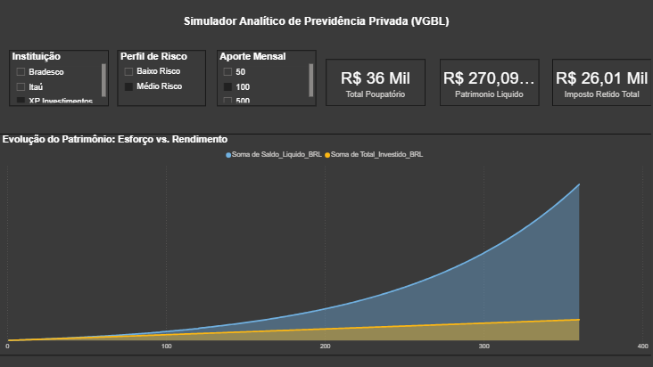

# 📊 Simulador Analítico de Previdência Privada (VGBL)

## 📌 Visão Geral
Este projeto é um simulador financeiro de longo prazo focado em analisar o impacto das taxas de administração e da tributação regressiva no acúmulo de patrimônio. O objetivo é responder a uma dor real de negócio: *Qual é a verdadeira diferença de rentabilidade entre os principais players do mercado ao longo de 30 anos?*

## 🛠️ Tecnologias e Arquitetura
- **Python (Pandas & Numpy):** Construção do "Motor Financeiro". O script simula cenários cruzados mês a mês (Aportes, Perfis de Risco e Instituições), aplicando lógicas de juros compostos e a tabela regressiva de IR para modelos VGBL.
- **Power Query:** Limpeza e transformação de dados, lidando com anomalias de formatação regional (conversão de padrões de pontuação de strings para decimais).
- **Power BI (DAX):** Modelagem dimensional e criação de um dashboard interativo (What-If Analysis) para visualização executiva da curva de crescimento do patrimônio.

## 📈 Lógica de Negócio Aplicada
O simulador permite a avaliação elástica através de filtros iterativos:
1. **Instituições:** Comparativo de impacto de taxas de administração reais de corretoras e bancos do mercado tradicional.
2. **Perfis de Risco:** Benchmarks de rentabilidade bruta para perfis conservadores (100% CDI) e moderados (Multimercado).
3. **Cenários de Aporte:** Simulação de contribuições acessíveis (R$ 50 a R$ 100) para demonstrar a eficácia do planejamento a longo prazo.

